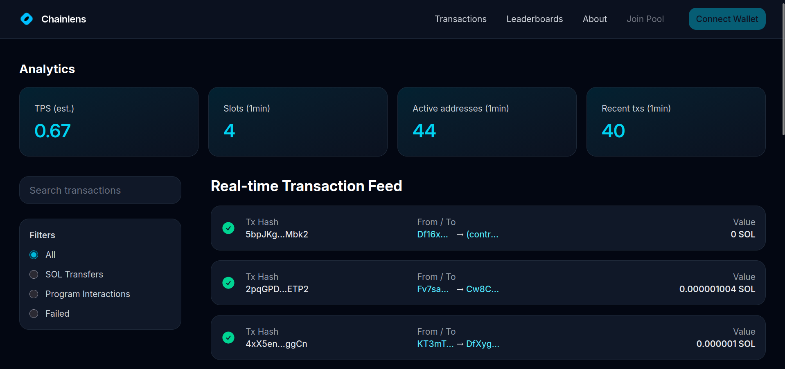
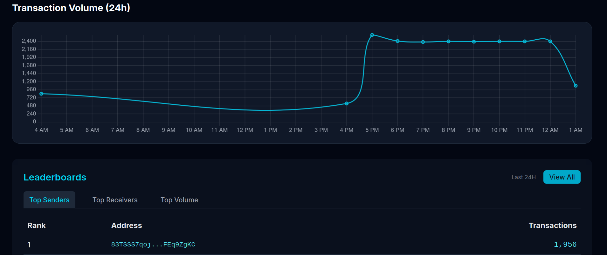

# ChainLens — Real-time Solana Explorer

ChainLens is a real-time explorer for the Solana blockchain. It indexes recent mainnet activity into a queryable database and presents it through a fast, analytics-focused web interface: live transaction feed, per-transaction and per-address detail views, network health metrics, volume charts, and leaderboards.

**Live demo:** https://chain-lens.vercel.app





## Features

- **Real-time transaction feed** — sampled mainnet transactions as they are indexed, with status indicators and value in SOL.
- **Transaction details** — full signature, status, fee payer, recipient, SOL value, slot, timestamp, fee, compute units, and involved programs.
- **Address pages** — activity summary (sent/received counts, total volume) plus paginated history for any address.
- **Search and filtering** — find transactions by signature or address; filter by SOL transfers, program interactions, or failed status.
- **Network analytics** — estimated TPS, slots per minute, active addresses, and recent transaction counts, refreshed continuously.
- **Volume chart** — hourly transaction volume over the last 24 hours.
- **Leaderboards** — top senders, receivers, and volumes over the last 24 hours.

## Architecture

```
Solana mainnet RPC ──poll──▶ NestJS indexer ──upsert──▶ Supabase (Postgres)
                                                              │
Frontend (React Router) ─────────reads (direct + RPC)─────────┘
```

- **Indexer** (`chainlens-backend/`, hosted on Google Cloud Run): every 15 seconds it samples the latest confirmed slot, parses SystemProgram transfers, skips vote-only consensus transactions, and upserts up to `TXS_PER_BLOCK` transactions. A nightly job deletes rows older than `TX_RETENTION_DAYS`, bounding table growth.
- **Database** (Supabase Postgres): a single `transactions` table plus SQL functions for analytics, volume, leaderboards, and address lookups. The frontend reads with the publishable key under a read-only access policy; the indexer writes with the secret key.
- **Frontend** (`app/`): server-rendered React app that queries Supabase directly. No custom API layer.

A note on scope: ChainLens is a *sampled* explorer, not an archive node. It stores a slice of recent activity (currently ~10 transactions per sampled slot, 3 days of history). Vote transactions are intentionally excluded.

## Tech Stack

| Layer    | Technology |
|----------|------------|
| Frontend | React 19, React Router v7, Tailwind CSS 4, Vite, Chart.js, Supabase JS |
| Indexer  | NestJS 11, Supabase JS (secret key), scheduled cron tasks |
| Database | Supabase (PostgreSQL with SQL functions) |
| Hosting  | Vercel (frontend), Google Cloud Run (indexer, 1 always-warm instance) |
| Chain    | Solana mainnet (`https://api.mainnet-beta.solana.com`) |

## Getting Started

### Prerequisites

- Node.js 20+
- A Supabase project
- (Optional) Google Cloud project with billing enabled, for the indexer

### 1. Set up the database

In the Supabase dashboard, open the SQL Editor and run `supabase/schema.sql` (fresh project) or `supabase/migrations/002_solana_switch.sql` (existing project from the EVM era). This creates the `transactions` table, indexes, the public read policy, and all RPC functions the frontend uses.

Then copy your credentials from Project Settings → API Keys:

- Project URL (`https://<ref>.supabase.co`)
- Publishable key (`sb_publishable_...`, for the frontend)
- Secret key (`sb_secret_...`, for the indexer — keep private)

### 2. Run the frontend

```bash
cp .env.example .env
# fill in VITE_SUPABASE_URL, VITE_SUPABASE_KEY, VITE_API_URL
npm install
npm run dev
```

The app runs at `http://localhost:5173`. All `VITE_*` variables are inlined at build time, so restart the dev server after changing them.

### 3. Run the indexer

```bash
cd chainlens-backend
npm install
# uses ../.env (VITE_SUPABASE_URL, SUPABASE_SECRET_KEY, VITE_API_URL,
# TXS_PER_BLOCK, TX_RETENTION_DAYS)
npm run start:dev
```

You should see `Latest slot:` followed by `Successfully stored transactions to Supabase` within seconds.

### Configuration

| Variable | Used by | Default | Purpose |
|----------|---------|---------|---------|
| `VITE_SUPABASE_URL` | both | — | Supabase project URL |
| `VITE_SUPABASE_KEY` | frontend | — | Publishable key (read-only via access policy) |
| `SUPABASE_SECRET_KEY` | indexer | — | Secret key (bypasses access policy for writes) |
| `VITE_API_URL` | indexer | — | Solana RPC endpoint |
| `TXS_PER_BLOCK` | indexer | `10` | Max transactions stored per sampled slot |
| `TX_RETENTION_DAYS` | indexer | `3` | Raw history window; older rows deleted nightly |

### Deploying the indexer to Cloud Run

```bash
gcloud builds submit --tag <region>-docker.pkg.dev/<project>/chainlens/chainlens-backend chainlens-backend

gcloud run deploy chainlens-backend \
  --image <region>-docker.pkg.dev/<project>/chainlens/chainlens-backend \
  --region <region> \
  --allow-unauthenticated \
  --min-instances 1 \
  --no-cpu-throttling \
  --memory 512Mi \
  --set-env-vars VITE_SUPABASE_URL="...",VITE_API_URL="https://api.mainnet-beta.solana.com",TXS_PER_BLOCK="10",TX_RETENTION_DAYS="3" \
  --update-secrets SUPABASE_SECRET_KEY=supabase-secret-key:latest
```

`--min-instances 1` and `--no-cpu-throttling` are required: without them the background schedule stalls. The frontend needs no backend URL — it reads Supabase directly, so it deploys independently (e.g. Vercel with the two `VITE_*` variables set).

## Project Structure

```
app/                    Frontend routes, components, Supabase client (app/lib)
chainlens-backend/src/  NestJS indexer (blockchain/, supabase/)
supabase/schema.sql     Full database setup for new projects
supabase/migrations/    Incremental migrations for existing databases
.env.example            Documented environment template
```

## Contributing

Contributions are welcome. Fork the repository, make your change with a clear commit message, and open a pull request against `main`.

## License

MIT. See [LICENSE](LICENSE) if present; otherwise all rights reserved by the repository owner.
